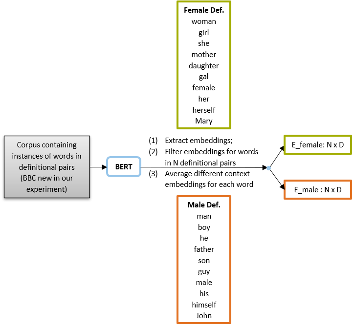
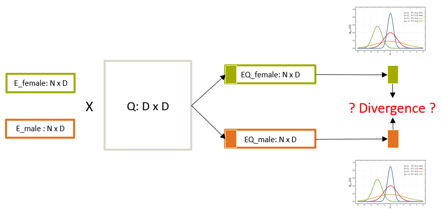

Towards Ultradense Contextual Embeddings by Distribution-Based Orthogonal Transformation
----

Re-implementation for my bachelor thesis project (thesis defense in April 2022). 

Project Description
----
Embeddings are widely used in natural language processing tasks. But one concern is that embeddings from existing language models are dense and high-dimensional, which is difficult for people to interpret. In this work, we propose a distribution-based method to identify ultradense subspace from contextualized embedding space.

We use pairs of words to define two different categories, e.g. [female and male](https://github.com/vwoloszyn/bias_on_word2vec/blob/master/data/definitional_pairs.json), and we extract bert embeddings for these pairs with the help of some corpora.

The embeddings form representation space for two categories. We multiply them with an orthogonal matrix Q and then take the first (or first several) dimensions. We view these dimensiosn as normal distribution and maxmize their divergence by [Wasserstein distance](https://en.wikipedia.org/wiki/Wasserstein_metric#Normal_distributions). We optimize $Q$ to maximize the distance, so that only the first dimension contains the categorty (gender) information.

For evaluation, we prepare a list of words, e.g. [professions](https://github.com/vwoloszyn/bias_on_word2vec/blob/master/data/professions.json). As in the first demostration, we extract bert embeddings with the help of the same corpora. We can already compute the cosine similarities of the word to *woman* and *man*, respectively. Then, we do the transformation with the optimized orthogonal matrix $Q$ and get the complement space (other than the first dimension) of transformed embeddings. We compute the cosine similarities of the word to *woman* and *man* in this complement space.

Here we present part of our results:

